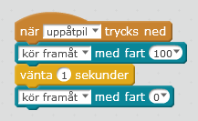

# mBot beskrivning

mBot är en enkel robot som drivs av 2 motorer. Uppe på roboten sitter ett styrkort som innehåller datorn som kontrollerar motorer och sensorer. De färgglada kontakterna användds för att ansluta motorer och sensorerna. Färgerna anger vilken typ av sensor eller enhet som kan anslutas till kontakterna.

På framsidan har roboten en avståndsmätare "ögonen". Denna kan användas för roboten skall kunna undvika hinder.

# Koppla upp mBot

mBot kopplas upp mot datorn via med hjälp av USB-sändaren som följer med roboten. Denna USB-sändaren kan bara prata med den roboten den tillhör. För att använda sändaren koppla in den i en ledig USB-port. Den kan ta en liten stund innan datorn har installerat sändaren. 

När sändaren är inkopplad startas roboten med strömbrytaren på robotens kretskort. Om allt har fungerat skall en blå lampa uppe på roboten lysa med ett blått fast sken.

# Starta mBlock - Scratch

Programmering av roboten sker med en speciell version av Scratch, mBlock. Denna version av Scratch innehåller speciella block för att kunna programmera robotar och elektronik. Programmet startas genom att klicka på symbolen på skrivbordet:

För att göra det enklare att använda programmet kan språket ändras från engelska till svenska i menyn **Languages**.

# Uppkoppling mBlock - Scratch

För att koppla upp mblock mot roboten väljer man **Anslut/2.4G Serial/Anslut**

Om allt fungerat skall det stå **Ansluten** längst upp i fönstret på mBlock.

mBlock används inte bara för robot programmering, så vi måste också tala om för mBlock att vi vill programmera en mBot. Detta görs genom att välja **Styrkort/mBot** i menyn.

# Vårt första program

Det första programmet vi skall skriva är låter roboten köra framåt i 1 s när man trycker på pil upp på tangentbordet.

## Steg 1 - Lägg till händelse block

Klicka på **Händelser** i **Skript** fliken för att visa händelseblocken. Dra in ett **När [....] trycks ned** block in på arbetsytan. Ändra **mellanslag** till **uppåtpil**

## Steg 2 - Lägg till robot block **Kör framåt**

För att kontrollera roboten måste vi klicka på **Robotar** i **Skript** fliken för att visa alla block som kan användas för att programmera vår mBot. Dra in blocket **Kör framåt** och anslut det till det det tidigare blocket vi skapade. Ändra hastigheten till **100**. Lägg till ett **vänta X sekunder** block från **Kontroll** och till sist ett **Kör framåt** block där hastigheten sätts till 0. Det färdiga programmet skall se ut så här:

## Steg 3 - Provkör

Vad händer?

* * *

# Uppgift 1 - Köra robot med piltangenter

Programmera roboten att vända med höger- och vänsterpilar och backa med nedåtpilen. För svängarna kan det vara bra att använda en kortare paus än 1 sekund.

* * * 

# Uppgift 2 - Köra med piltangenter utan paus

I de tidigare uppgifterna kontrollerades roboten genom att vi startade roboten, väntade en sekund och sedan stoppade roboten. Om vi vill kunna kontrollera roboten mer exakt kan man låta roboten starta när en tangnet trycks ned och stoppa roboten om en tangent släpps upp. För **uppåtpilen** blir blocken:

* * * 

# Uppgift 3 - Köra i en kvadrat

Många gånger vill man roboten skall köra själv utan instruktioner från oss. I denna uppgift skall vi få mBot att köra rakt fram, vända och upprepa detta så att vi kommer tillbaka där vi startade. Det kan vara lite trixigt att få till svängarna så att roboten snurrar exakt 90 grader. Prova med olika pauser mellan blocken för att få in rätt sväng.

> Tips: Det kan vara bra att alltid ha med ett block för en tangent som stoppar motorerna i det fall att ens program inte stannar roboten.

> Tips: Avsluta alltid programmet med att stanna båda motorerna. 

* * *

# Använda upprepa för att få mBot att köra i andra mönster

I de tidigare uppgifterna blev det många block som staplades ovanpå varandra. Om instruktionerna är samma kan man använda ett **upprepa** block för att utföra dem för alltid eller ett visst antal gånger. Följande program använder **upprepa** block för att utföra vissa instruktioner upprepade gånger.

Vad händer?

* * * 

# Uppgift 4 - Få roboten att spela en halvnot för varje upprepning

Använd den inbyggda tongeneratorn för att spela en not för varje upprepning. Spela en annan not när programmet är slut.

* * *

# Uppgift 5 - Få robotens LED lampor att blinka 10 ggr när roboten har stannat

Använd ett **upprepa** block för att blinka LED lamporna 10 ggr mellan rött och blått. När det är klart sätt lamporna till 0.
 
* * *

